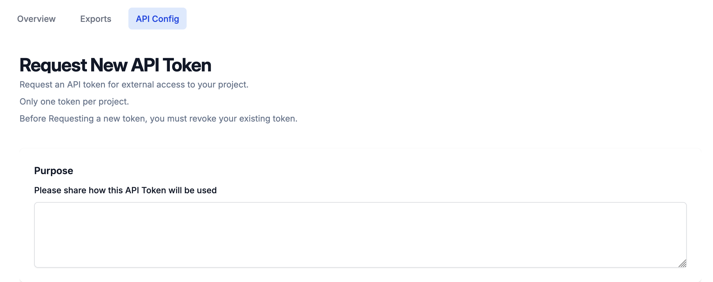
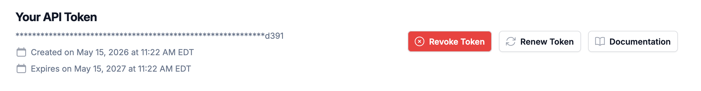
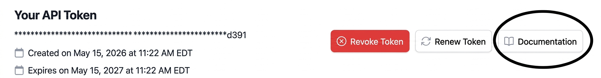
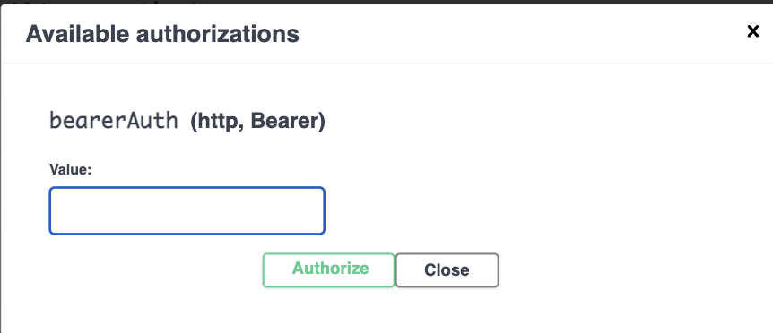
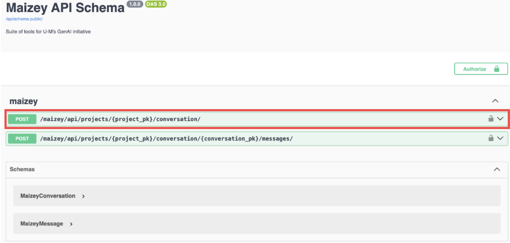
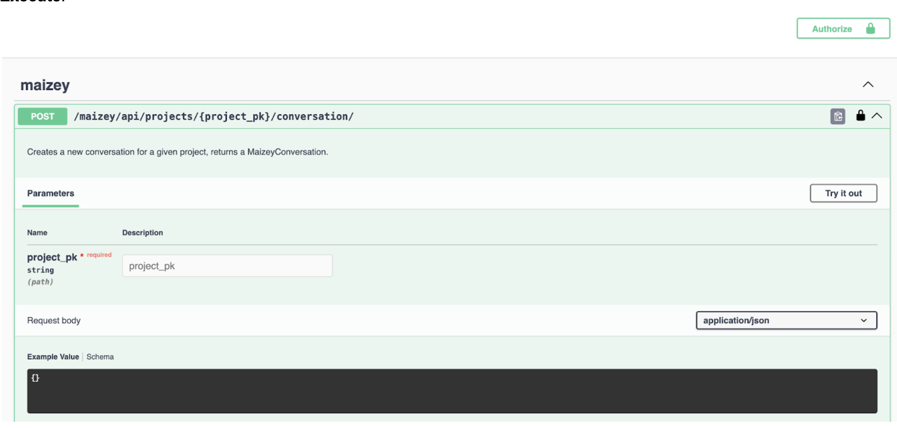
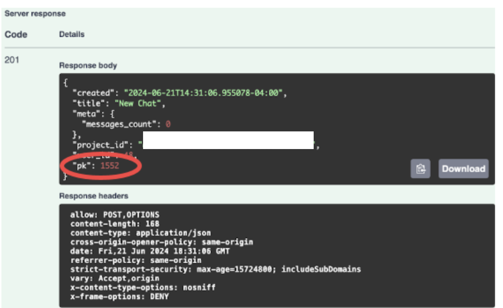
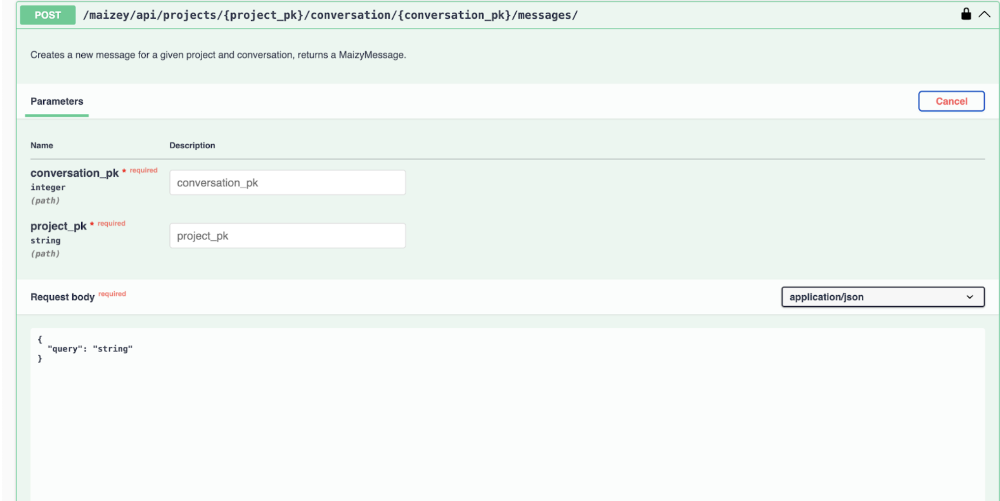

# U-M Maizey API - Create an API Key

Once you’ve created your Maizey project and added an app to it, you’ll have access to the **Configure App** settings. Under Apps, click the three dots on the right side of the app name to access the **Configure App** settings.


To create a new API token, select **API Config** from the menu. Provide a purpose for the token, agree to the terms and conditions, and then click **Submit**. A pop-up window displays with your token. **Save it in a secure location; you will not be able to see it again after you close the popup.** You will need to generate a separate token for each Maizey App you want to use with the API.



The **API Config** tab then displays an overview of all the events using that token. Click the **Documentation** button for information about how to use your token.



# Navigating the U-M Maizey API Documentation

After opening your project, click the **API Config** tab and then click the **Documentation** button. Alternatively, you can acccess the documentation at https://umgpt.umich.edu/api/schema-public/swagger-ui/. 



A page detailing Maizey’s API schema and allowing developers to try it out displays. To begin, click **Authorize** and paste your token in. Then, open the first collapsible panel. This endpoint allows you to create a conversation in Maizey.




Click **Try it out**, then navigate to the **Details** page for your Maizey project and copy the **Project ID**. Paste your ID into the **project_pk** field in the documentation. Finally, scroll down and click **Execute**. 



In the response, copy the number next to **“pk”**: (**1552** in the example pictured below). 



Open the second collapsible panel. This endpoint allows you to create a message in your conversation. Click **Try it out** and paste your **pk** into **conversation_pk** (the integer from earlier). Then, paste your **Project ID** from earlier into **project_pk**. In the **Request body**, replace **“string”** with your query. Scroll down and click **Execute**. It may take a moment to load.



The output will contain the response from your Maizey.


If you go back to your Maizey project, you will see that your query and response will also be reflected as a new chat. Remember that there is no endpoint for managing or deleting apps, conversations or messages at this time.


# Powershell and Python Examples

In this folder, we have also provided example Powershell and Python scripts for interacting with the Maizey API. 

## Powershell Example

1. Open a PowerShell terminal and navigate to the Maizey API folder:  

    ```
    cd "ITS-Examples/Maizey API"
    ```               

2. Import the module: 

    ```
    Import-Module ./maizeyApi.psm1 
    ```    

3. Call the function with your values:   

    ```
    New-MaizeyChat -maizeyProjectId "your-project-id" -prompt "your-question-here" -apiKey "your-maizey-app-token"       
    ```                      
  
## Python Example

1. Copy `.env.example` to `.env` and fill in your credentials:

    ```
    cp .env.example .env
    ```

    | Variable | Description |
    |----------|-------------|
    | `token` | Your Maizey App API token |

2. Fill in the project_pk variable in maizeyapi.py with your Maizey Project ID.
3. Replace the query in maizeyapi.py with whatever you would like to ask Maizey. 
4. Note that the token in your .env file is the token for an individual Maizey App. To interact with a different app, generate a new token for that app and paste that credential into your .env file instead. 
